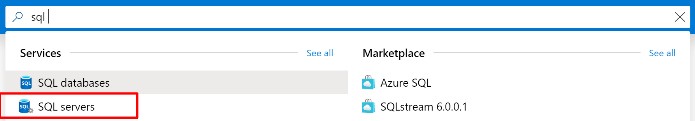
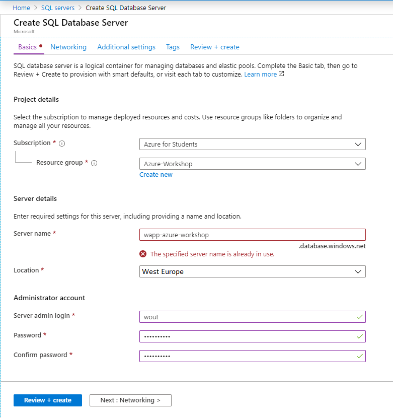
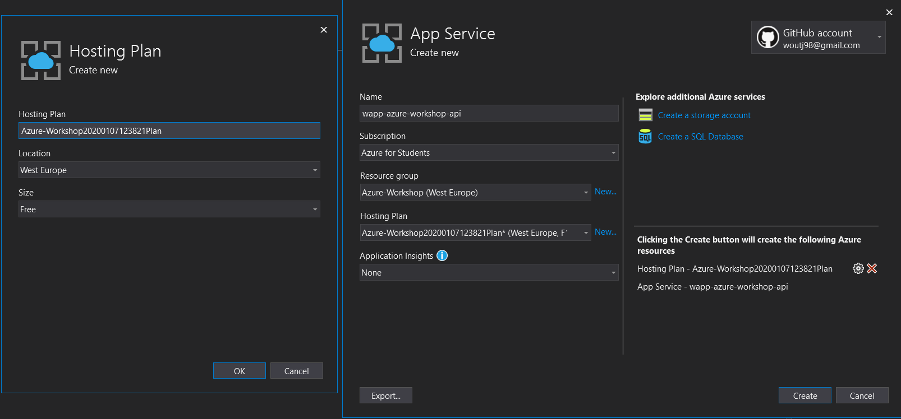

# Prerequisites
Om deze demo te volgen, is het belangrijk dat je eerst een Azure account gemaakt hebt en een studenten license gekoppeld hebt aan dit account.
Als je dit nog niet gedaan hebt, maak een account aan op https://azure.microsoft.com/en-us/.

Om 100$ gratis credit te krijgen, koppel je account hier: https://azure.microsoft.com/en-us/free/students/

De applicatie die we later gaan deployen draait op dotnet 3.1 (Niet de preview). Deze kan je hier downloaden: https://dotnet.microsoft.com/download/dotnet-core/3.1

# Database
Ga naar https://portal.azure.com/ en log in. Je komt nu uit op een overzicht pagina met bovenin `Azure-services`. Klik vervolgens op SQL-servers of zoek in de zoekbalk naar `SQL server` en klik deze aan. **KLIK NIET OP SQL DATABASE** Deze maken we later aan! 

Je komt hierbij op een nieuwe pagina uit met een overzicht van alle SQL-servers. Om een nieuwe SQL server aan te maken, klik je op `Add`. Je komt dan op een pagina om een sql server aan te maken.

Zorg ervoor dat bij subscription staat **Azure for Students**. Als die optie niet aanwezig is, moet je nog even goed kijken of je jou studenten account gekoppeld hebt aan Azure.

Als eerste maak je een `resource group` aan. Dit kan je noemen zoals je zelf wilt. Een `resource group` is een collectie van services die relateerd aan elkaar zijn. (Je SQL server, Redis cache en web api)

Vervolgens gaan we de `server details` invullen. 
- **Server name**: De server name moet uniek zijn omdat deze gebruikt word om te connecten naar je sql server.
- **Location**: Zet deze naar: `(Europe) West-Europe`
- **Server admin login**: De username van de server admin. Dit is de root. 
- **Password**: Een wachtwoord naar keuze. Verlies deze niet!

*Je instellingen zouden er nu zo uit moeten zien.*

Je klikt dan op het tabje `networking`. Hier zet je onder `firewall rules` de optie `Allow Azure services and resources to access this server` naar `yes`. Hierdoor kan je connecten naar je sql server. 

Vervolgens klikken we op het tabje `additional settings`. Hier zet je `Enable advanced data security` naar `not now`. Dit voorkomt extra kosten. 

Wanneer je alles ingestelt hebt, ga je naar het tabje "review + create". Controleer hier nog 1 keer de gegevens en klik je vervolgens `create`. De sql server word aangemaakt. Hier gaan we later databases aan toevoegen.  

**Het duurt een aantal minuten voordat de SQL server aangemaakt is!**

Natuurlijk willen een database hebben binnen de SQL server. Om dit te doen kunnen we de `Microsoft SQL Server Management Studio` (SSMS) openen en verbinden met de server. Hiervoor heb je de volgende gegevens nodig die eerder ingevuld zijn:
- **Server name**
- **Server admin login**
- **Password**

Mogelijk moet je inloggen met je azure account en vraagt SSMS om een firewall rule toe te voegen. Hier kan je op okay drukken. 

*Als je de servernaam vergeten bent, kan je bovenin in de zoekbalk van azure naar sql servers zoeken. Hier open je de aangemaakte sql server. Rechtsbovenin zie je de server admin en server name van je sql server.*

# Redis Cache
Ga naar https://portal.azure.com/ (en log hier in). Je komt nu uit op een overzicht pagina met bovenin `Azure-services`. Klik vervolgens op `Create a resrouce`. Zoek hier naar `Redis-cache` en klik vervolgens op het eerste resultaat. Soms heet de service `redis-cache` en soms `Azure cache for redis`. Je komt dan op de introscherm van de service en klik hier op `create`. 

**Let goed op, dit kost geld!**
Zorg ervoor dat bij `subscription` staat **Azure for Students**. 

- Voer een `DNS name` in naar keuze. Deze naam moet net zoals je SQL server uniek zijn. Kies dus een naam die nog niet bestaat.
- Bij `resource group` selecteer je de aangemaakte groep van de sql server.
- Bij `location` selecteer je West-Europe.
- Bij `pricing tier` willen we iets meer informatie over de prijzen. Klik hier op `view full pricing details`. 

Een redis-cache is best prijzig. De meest goedkope optie is `c0 Basic 250mb cache`. Deze optie kost ongeveer 14 euro per maand. Je klikt hierna op `create`. 

# Importeren database
We beginnen met het downloaden van deze github repo. Hierin vind je de applicatie en de database. In `SSMS` importeer je in je azure sql server de database. Dit kan je doen doormiddel een rechter muisklik te doen op databses en dan `Import Data-tier application` te selecteren. Tijdens het importeren vraagt SSMS wat voor soort database je wilt aanmaken. Je selecteert dan de standaard instellingen. 

**We veranderen deze instellingen later! Doe je dit niet, ben je binnen een week door je tegoed heen. Als je deze nu aanpast, duurt het importeren ruim een halfuur**

Nu word er een database gedeployd online met alle gegevens van de insideAirBNB database. Dit duurt ongeveer 5 minuten dus je kan even wachten. 

Nu de sql database gedeployd is, gaan we de subscription aanpassen. Ga naar https://portal.azure.com/. Klik vervolgens op `SQL-databases` onder Azure services. Je ziet hier de AirBNB database staan, klik hier op. Rechtsbovenin staat `Pricing tier`. Klik hierop. 

Je komt op een nieuw scherm terecht. Hier kan je de samenvoeging van de server veranderen. Bovenaan staan 3 paketten: `Basic`, `Standard` en `Premium`. Rechts van premium staat `vCore-based purschasing options`. Klik hierop. Er komen nieuwe opties op het scherm. `General Purpose` is standaard geselecteert. Om niet teveel te betalen, gebruiken we een `serverless` server. In plaats per maand, betaal je hier per seconde dat je de database gebruikt. 

Om de database een beetje snel te houden, kan je het minimum en maxium aantal vCores aanpassen. Je kan hier zelf aanpassen hoe snel je de database wilt hebben, maar let natuurlijk wel op kosten. Minimaal 1 vCore en maximaal 2 vcores is voldoende voor airBNB aangezien we gebruik maken van caching en minimaal aantal gebruikers hebben. De maximale database groote kan je aanpassen bij data max size. Voor nu zetten we deze op `4gb`.

Je kan de optie `Enable auto-pause` uitvinken. Dit kost je iets meer per maand, maar hierdoor kost het niet 2 minuten om de database op te starten wanneer je deze even niet gebruikt hebt. Dit scheelt tijd bij je assesment van je beroepsproduct. 

Wanneer alles aangepast is, kan je onderin op `apply` klikken. De database subscription wordt omgezet. Dit duurt een kleine minuut. Als je dan de pagina van je AirBNB database refresht, zie je dat de pricing tier aangepast is. 

De instellingen van je subscription. 

# Deploy API
Open vervolgens `Visual Studio 2019` met daarin de solution die je gedownload hebt van de github repo. We moeten hier eerst een aantal dingen aanpassen voordat we kunnen publishen. In de appsettings moeten we de connection string aanpassen naar de Azure SQL database. Deze connection string is te vinden op https://portal.azure.com/. Ga dan naar SQL-databases en klik op de aangemaakte AirBNB database. Rechtsbovenin staat het veld `Connection strings`. Klik hier op `Show database connection strings`. Hier kan je verschillende connection strings kopieren. Kopieër de ADO.NET connection string en vul deze in bij bij `SqlConnection` in `appsettings.json`. van de applicatie. Vergeet niet om het gedeelte `{your_password}` in de string te veranderen naar je wachtwoord van de SQL-server. **Verwijder de { }** 

Als laatste moeten we Redis nog koppelen. Ga naar https://portal.azure.com/ en zoek naar `Resource groups`. Klik vervolgens op de resource group die je aangemaakt hebt hierboven. Klik hier op de `Azure Cache for Redis` service. Rechtsbovenin staat het veld `keys`. Klik hier op `show access keys...`. Rechts word een menu geopend met daarin de verbindingsreeks. Kopieër de connection string onder `Primary connection string (StackExchange.Redis)`. Vervolgens vervang de string die hoort bij `RedisConnection` in `appsettings.json` met de redis connection string.

Nu kunnen we de API deployen. Klik met je rechtermuisknop op de `Azure-Workshop project` (Niet de solution). Selecteer `Publish...`. Er wordt nu een nieuw scherm geopend. In dit nieuwe scherm selecteer je `App Service` en selecteer je `Create New`. 

Log in met je azure account. Je krijgt nu een instellingen scherm te zien. Check dat bij `subscription` **Azure for Students** staat. 

De `name` wordt automatisch voor je ingevuld. Je kan deze aanhouden of veranderen. Vervolgens kies je de aangemaakte `resource group` van de SQL en redis-cache. Bij `Hosting Plan` gaan we een hele nieuwe hosting plan maken. Klik hier op `New...`. Zorg ervoor dat de instellingen er al volgt uit zien:

- **Hosting Plan**: ingevuld laten zoals die is of zelf een naam geven, dit maakt niet uit.
- **Location**: West Europe.
- **Size**: Free.

Hoe je instellingen van je hosting plan ongeveer eruit moeten zien.

Druk vervolgens op `OK`. De `Application Insights` kan gewoon op `none` blijven staan. Klik vervolgens op `Create`.  

Je komt nu in een overzichts pagina. Kopieer de site url zodat je later de site makkelijk terug kan vinden. Druk vervolgens rechtsboven op `Publish`. De site word nu gedeployd op azure and je kan het gaan gebruiken.